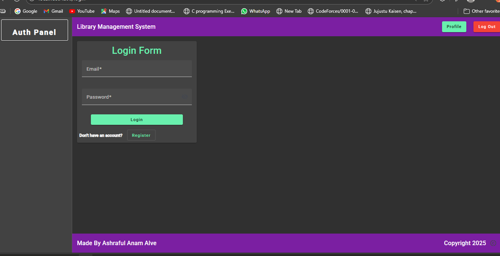
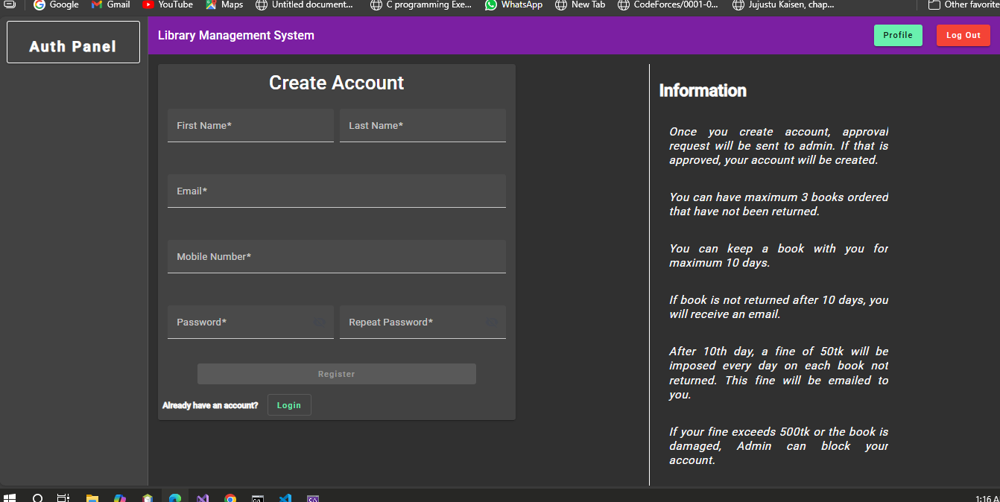
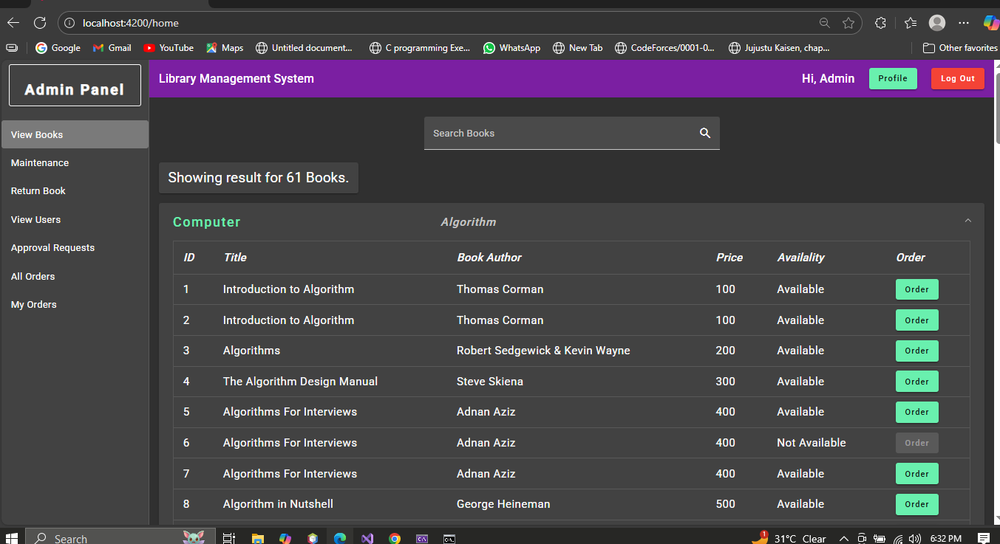
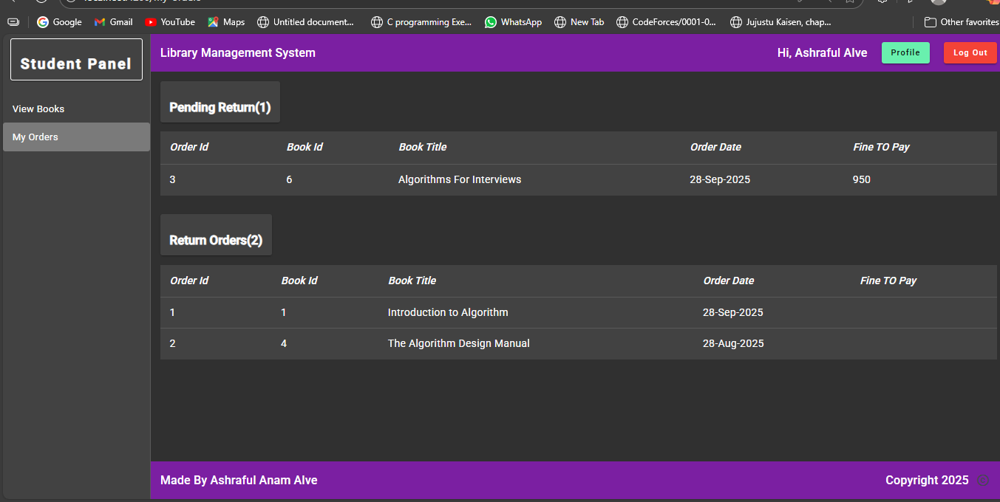
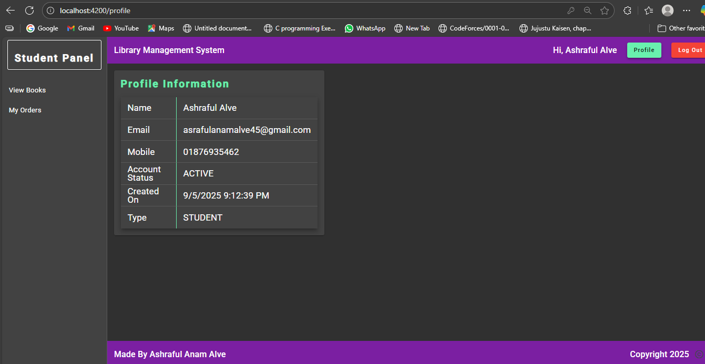
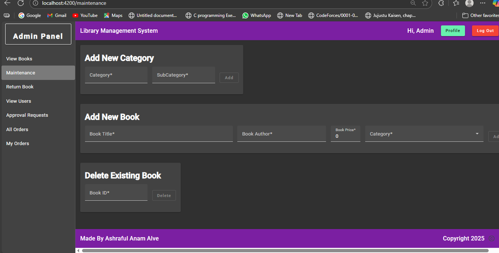
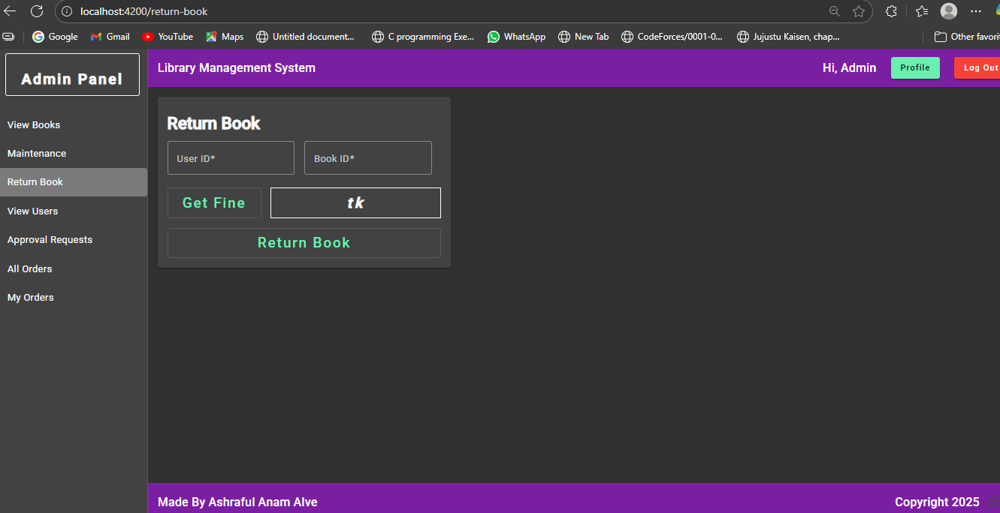
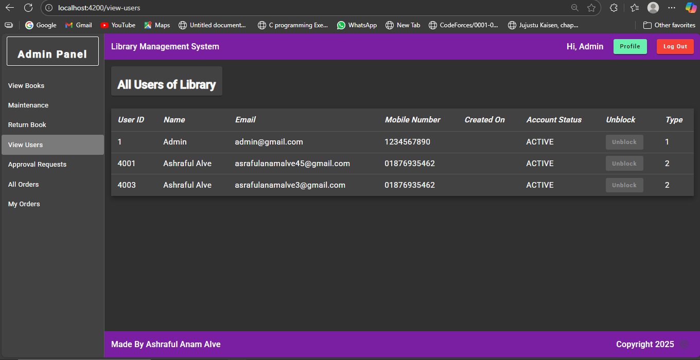
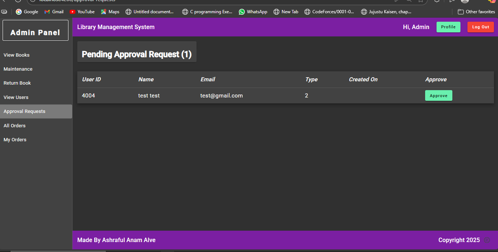
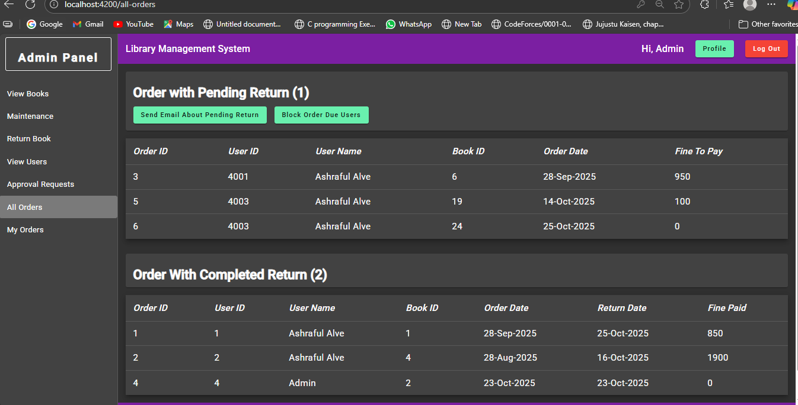

# 📚 eLibrary – Library Management System

A complete **Library Management System** built using **ASP.NET Core Web API**, **Angular**, and **SQL Server**.  
This system allows **users** to register, borrow books, and manage their orders, while **admins** can manage users, books, and monitor all library operations.  
JWT authentication ensures secure login and role-based access.

---

## 🧠 Project Overview
The **eLibrary** system digitalizes the entire book borrowing and returning process.  
Users can order books after admin approval, and admins can track, approve, or block users as needed.

Fine and blocking mechanisms are automated:
- If a book is not returned within **10 days**, a fine of **৳50 per day** applies.
- When the fine reaches **৳500**, the user account gets **automatically blocked**.

---

## 👥 Roles & Features

### 🧑‍🎓 **User**
- Register for an account.
- Login after admin approval (JWT-based authentication).
- View available books.
- Order books.
- View their own orders.
- Search for books.
- View fine details for late returns.

### 🧑‍💼 **Admin**
- View all books and manage categories.
- Add, edit, and delete books.
- Approve or reject new user registration requests.
- View all users.
- Block or unblock users.
- View and manage all orders.
- Manage book returns (calculate and mark fines as paid).
- Send emails to users directly through the system (SMTP Server).
- Maintain full library operations through the dashboard.

---

## ⚙️ Technologies Used
| Layer | Technology |
|-------|-------------|
| **Frontend** | Angular |
| **Backend** | ASP.NET Core Web API |
| **Database** | Microsoft SQL Server |
| **Authentication** | JWT (JSON Web Token) |
| **IDE** | Visual Studio & VS Code |
| **Language** | C#, HTML + Angular syntax + Angular Material components, CSS |

---

## 🗂️ Database Name
coming soon

---

## 📸 Screenshots

### 👤 User Interface
| View | Image |
|------|--------|
| Login |  |
| Register |  |
| View Books |  |
| My Orders |  |
| Profile |  |

### 👨‍💼 Admin Interface
| View | Image |
|------|--------|
| View Books |  |
| Maintenance |  |
| Return Book |  |
| View Users |  |
| Approval Requests |  |
| All Orders |  |

---

## 🔐 Authentication System
- Secure login using **JWT tokens**.
- Admin approval required before a new user can log in.
- Role-based access control ensures separate views and privileges for Admins and Users.

---

## 💡 Fine System Logic
- User must return the book within **10 days**.
- If late:
  - `Fine = Days Late × 50`
- If fine ≥ 500:
  - Account automatically **blocked**.
- Users can view and pay fines from their dashboard.

---

## 📬 Contact
**Developer:** Ashraful Anam Alve  
📧 Email: *[asrafulanamalve45@gmail.com]*  
🏫 Bangladesh University of Business and Technology (BUBT)

---

## 🏁 Conclusion
This **eLibrary Management System** is a secure, efficient, and user-friendly digital solution for managing all library activities — from user registration to book maintenance and fine management. It provides smooth coordination between users and administrators.

---
## 🙏 Acknowledgment
Special thanks to online resources and ChatGPT guidance for helping me understand and complete this project successfully.

⭐ *If you find this project helpful, please give it a star on GitHub!* ⭐
